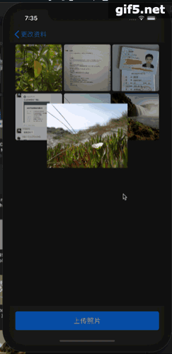

# iOS仿微信朋友圈图片查看器Swift版
> 一个仿照微信朋友圈的图片查看器，下滑背景变透明退出查看。原代码来自[https://www.jianshu.com/p/18f94073fb2f](https://www.jianshu.com/p/18f94073fb2f)，感谢原作者的开源分享。原代码是Objective-C版，这份代码全部用Swift重写。原代码有长按（3D Touch）弹出点赞、评论的操作，这个版本没有，因为自己暂时不需要这个。由于用了SDWebImage库，因此需要加入SDWebImage库。




## Features

- [x] 加载网络图片
- [x] 下滑退出动画

## Requirements

- iOS 11.0+
- Xcode 11+

## Installation


#### Manually
1. Download and drop ```ImageBrowser``` in your project.  下载文件夹ImageBrowser并放入项目中。
2. Remember to install SDWebImage!  记得安装SDWebImage！

## Usage example

```swift

let imageUrls = ["http://olxnvuztq.bkt.clouddn.com/b01.jpg","http://olxnvuztq.bkt.clouddn.com/b02.jpg","http://olxnvuztq.bkt.clouddn.com/b03.jpg","http://olxnvuztq.bkt.clouddn.com/b04.jpg","http://olxnvuztq.bkt.clouddn.com/b05.jpg","http://olxnvuztq.bkt.clouddn.com/b06.jpg"]

let imageBrowserManager = ImageBrowserManager()
// imageUrls代表查看的网络图片的网址的数组，originalImageViews代表原始的被点击的imageViews，controller一般是self
imageBrowserManager.imageBrowserManagerWithUrlStr(imageUrls:self.imageUrls, originalImageViews: self.originImageViews, controller: self, titles: [])
//imageNum代表被点击的imageView是imageViews数组中的哪一张图片
imageBrowserManager.selectPage = imageNum
imageBrowserManager.showImageBrowser()


```

## Contribute

We would love you for the contribution to this project.

## Meta

汤佳桦  – tangjiahua@bit.edu.cn


[https://github.com/tangjiahua](https://github.com/tangjiahua)

